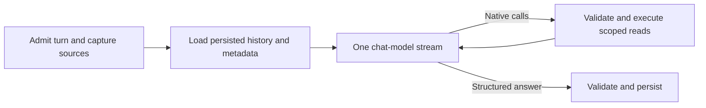

# Document assistant tools

Status: single-prompt six-tool implementation and bounded deterministic/live API verification completed on 5 October 2026; broader quality and browser acceptance remain pending. Executed checks and live outcomes belong in [progress.md](progress.md). Passage retrieval applies a strict cosine >0.6 floor to semantic candidates, combines independent lexical matches with RRF, and has no post-fusion cosine filter. This design does not claim that tool calling guarantees factual accuracy.

## Outcome and baseline

Help questions can finish without retrieval. Generic summaries and key takeaways read selected-document overviews. Specific facts use original-passage retrieval. Processing questions require fresh operational reads. Topic discovery searches the library without silently changing the chat's selected QA sources.

Chat submission does not require selected files. The agent receives an empty selection and decides whether it can help directly or needs a document; document-content requests prompt for selection/upload through a normal persisted clarification. Missing selection does not imply an empty library, and document tools cannot expand it into workspace-wide content access. Explicit library discovery and workspace-status requests remain available. Selected source validation and pinned retry snapshots still apply.

Before this implementation, chat always ran rewriting and retrieval, ignored stored document insights, and sent only the last 20 visible turns. Both semantic and lexical search required cosine similarity greater than 0.7 and returned at most five chunks. Generic requests such as “summarise this PDF” could therefore retrieve nothing even when processing had succeeded. These are baseline observations, not the current execution contract.

Installed APIs inspected for this change were LangGraph 1.2.12, OpenAI SDK 2.54.0, Pydantic 2.13.5 and pgvector-python 0.5.0. No new model dependency is required.

## Tool boundary

All actual tool logic, input models and definitions live outside `llm/`:

- `tools/models.py`: strict inputs and tool-call/result contracts.
- `tools/definitions.py`: native schemas and the prompt catalog generated from the same descriptions.
- `tools/runtime.py`: validated handlers with captured source scope.
- `tools/discovery.py`: derived overview indexing and topic discovery.

| Tool | Input | Result |
| --- | --- | --- |
| `get_selected_document_overviews` | Nullable document-page cursor | Bounded derived previews, availability and a few original supporting snippets. Missing insights yield labeled source samples with incomplete coverage. |
| `retrieve_relevant_chunks` | Standalone factual query | At most five qualifying original chunks with source IDs and locators. An empty result does not establish document-wide absence. |
| `search_documents` | Topic query, nullable cursor | Topic-ranked current document cards. Results do not expand selected QA scope. |
| `get_document_processing_metrics` | Selected/workspace scope | Timestamped counts of latest uploaded revisions, once per live document; separate insight states and current-ready source availability. |
| `get_document_processing_diagnostics` | Selected version ID | Safe bounded job/stage/error history; no implicit replay. |
| `get_document_analysis_result` | Artifact ID from the user or an earlier result | Saved status and a bounded cited preview, restricted to artifacts whose pinned sources are all selected. No job creation. |

The agent has no raw-section traversal, summary-creation or comparison-creation tool. Detailed/custom summaries and comparisons remain available through the existing Files dashboard and API endpoints, using shared idempotent admission in `analysis.py`.

Selected IDs, accounting identity and source snapshots come from the backend. Strict Pydantic arguments are validated again before execution. Unknown tools, forged references and unavailable resources return safe errors. Independent reads may run concurrently; dependent calls remain sequential. A result explicitly distinguishes successful empty data, unavailable insight state and failure.

## Bounded content and provenance

An overview page includes at most five selected documents. Each derived preview includes at most 1,600 summary characters, four insight previews of at most 400 characters, and three original supporting passages. Insight previews require their entire citation set to be among the supplied originals. Supporting sources prefer individually cited insights rather than only the first broad summary references. The derived summary is orientation, not independent evidence for every claim.

When insights are pending or failed but original processing is ready, return first/middle/last source samples, at most three chunks, and explicit incomplete coverage. This permits a limited overview without traversing the raw file. Pagination advances across selected documents, not successive source sections. Source excerpts are bounded and indicate excerpt truncation. Saved artifacts similarly expose previews and a result link rather than complete artifact bodies.

Final factual claims must use original source IDs in the captured selection. Stored evidence and public citations retain complete original passage text and rendering geometry. Model-facing records omit repeated bounding boxes and raw spans while retaining IDs, readable locators and passage text. This reduces context overhead without changing extracted content or public citation locations. Reference validation establishes provenance; reviewed claim support remains a separate quality gate.

## Overview discovery index

Original `Chunk` records remain citation authority. A separate `document_overviews` row per version combines title, category, tags, summary and insights. It stores text/content, generation and embedding identities plus native HNSW/GIN indexes. Hybrid discovery uses 15 semantic and 15 lexical candidates, RRF and pages of five cards; transparent scores are discovery signals, not truth probabilities. It does not apply the passage search's semantic similarity floor.

Successful insights schedule an idempotent `overview_index` job. Discovery-index failure leaves source readiness and insight success unchanged and remains visible in diagnostics/dead letters. A resumable backfill indexes existing ready insights without reparsing; failed/pending insights are skipped. Discovery filters current ready live versions, excludes obsolete sources and invalidates reuse when overview content/generation/model changes. Generated migrations use the Alembic CLI.

## Execution, history and display

LangGraph conditional edges allow zero or multiple tools. Native calls retain matching IDs/results; six rounds and the existing generation deadline bound execution. One configured chat model and `CHAT_SYSTEM_PROMPT` handle native calls and final structured streaming through `stream_chat_turn`; there is no separate selector or answer-generation agent. Usage for selection, generation, embeddings, history summarization and any reference repair is recorded.

Full messages remain in PostgreSQL; context is not selected with a fixed last-20-turn cutoff. Before a new turn, at an estimated 85% of the advertised chat model window, using OpenRouter metadata with configured fallback and output reservations, summarize older complete turns and retain recent complete turns. Persist memory/checkpoint IDs in `Chat.context_summary`. Memory retains source boundaries and is untrusted conversational context, never document evidence. There is no artificial configured-token preflight rejection of generation calls; actual provider failures remain explicit.

Formatting follow-ups may reload original previously cited chunks only when the preceding source snapshot matches the current selection. Changed selections discard reuse; forged/deleted references fail safely. Clear referents can be resolved from compact persisted traces; ambiguous subjects clarify. PostgreSQL remains history authority, without a checkpointer or durable mid-turn-resume claim.

Safe tool progress is persisted in `Message.agent_trace` and sent through SSE `tool.updated`. The chat displays structured tool activity through assistant-ui `ToolTimeline` and nested `ToolCall` disclosures adapted to the installed runtime; each invocation appears once with its actual state. Traces expose names, statuses, references and safe receipts, not raw source content or internal reasoning. Public answer, suggestions (at most three), citations and outcome stay compatible. The prompt requests one to three useful follow-ups when possible, with empty lists reserved for no useful next question; the UI renders them only after canonical completion.

The SDK receives a per-turn Pydantic response schema: citation IDs are limited to the supplied original-evidence enum, or an empty list when no original evidence exists. Job, artifact, version and document identifiers never become citations. Inline/list validation still runs; native schema constraints do not establish factual accuracy. A bounded reference-only repair can correct citation formatting against identical grounding. It cannot change source scope or establish the truth of a claim. Invalid output remains a visible failure. Help does not fabricate citations; document answers require original provenance; catalog/operational answers require fresh successful receipts.

## Verification

Verify greetings without retrieval; all reported generic prompts; sampled fallback when insights fail; original citations; selected-version/deletion guards; live metrics excluding history; discovery without source expansion; strict unknown/forged tool handling; saved-result previews; formatting follow-ups; history compaction and usage; cancellation/retry/cache regressions; persisted tool traces and SSE display.

Run deterministic provider/graph tests, real PostgreSQL scope/index/migration tests and frontend checks, then a bounded authorized API pilot on the four existing documents. Report factual review, coverage, latency and usage separately from transport and schema checks. Preserve failed acceptance cases and distinguish historical evidence from candidate outcomes. Browser validation remains user-owned unless explicitly authorized.

## Primary research

- [OpenAI function calling](https://developers.openai.com/api/docs/guides/function-calling): native call/result protocol, server-known arguments and SDK-generated strict schemas.
- [OpenRouter tool calling](https://openrouter.ai/docs/guides/features/tool-calling): endpoint capability, native tool decisions and matching result IDs.
- [OpenAI structured output schema constraints](https://developers.openai.com/api/docs/guides/structured-outputs): supported enums and array bounds; SDK/Pydantic validation remains mandatory.
- [OpenRouter structured outputs](https://openrouter.ai/docs/guides/features/structured-outputs): provider-specific schema support.
- [LangGraph agents](https://docs.langchain.com/oss/python/langgraph/workflows-agents): conditional execution.
- [Anthropic tool engineering](https://www.anthropic.com/engineering/writing-tools-for-agents): distinct tools, compact useful results and realistic evaluations.
