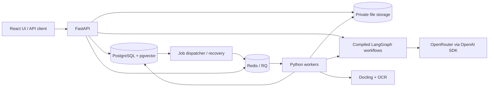
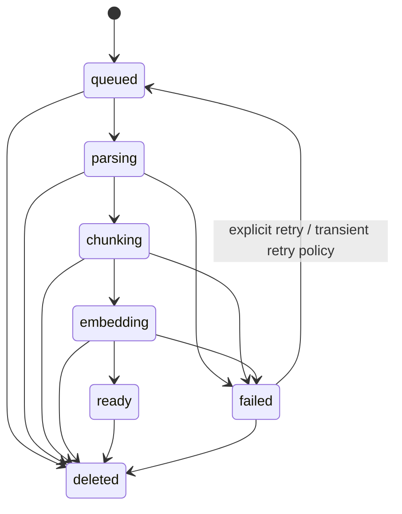

# DocVault LLM specification

Status: approved direction; implementation in progress. Updated: 4 October 2026. Verification status is tracked in [implementation-plan.md](implementation-plan.md).

Source: the four-page supplied assignment, `ai powered document vault system.pdf`, followed by the user's design decisions in this conversation. This document defines the target contract; a feature is not verified merely because it appears here. Backend and frontend work are underway, with live integration and acceptance evidence recorded separately.

## 1. Outcome and scope

A user uploads documents, sees processing progress, reads useful LLM insights, and asks follow-up questions with citations that open the exact supporting source. They can compare documents or versions and inspect processing reliability and LLM usage.

The submission must include a working **Python backend**, PostgreSQL, a real task queue, document parsing, a supported hosted model/embedding integration, storage, API documentation, an `AI_USAGE.md`, and a required document-chat demo. The assignment gives approximately equal weight to AI-first development, product thinking, and technical implementation. A UI is optional in the assignment and included here to cover its bonus.

Delivery is staged, but the target includes every bonus item in section 13. The first complete slice is upload -> asynchronous processing -> one cited answer -> persisted history -> metrics. All-bonus completion is a later release gate, not a claim about that first slice.

### Current decisions

| Topic | Initial decision |
|---|---|
| Deadline | Awaiting user input; milestones are ordered without assuming a submission date. |
| Providers | OpenRouter for generation and embeddings through the OpenAI Python SDK, with `base_url=https://openrouter.ai/api/v1`. Independent task configurations: chat/summaries default to `openai/gpt-4.1-mini`, rewriting to `openai/gpt-4.1-nano`, comparisons to `openai/gpt-4.1`, embeddings to `openai/text-embedding-3-small`. Each is environment-overridable; actual account/model checks are recorded in the ledger. The user reports the provider key is configured in local `.env`; keep it server-side. |
| Deployment | Reproducible localhost Docker Compose demo. Bind published service ports to loopback. Public deployment is outside the current scope. |
| Formats | PDF, DOCX, UTF-8 TXT; digital and scanned PDFs. English is the first tested language. Other languages are best effort and clearly labeled. |
| Limits | Configurable upload safeguards: 25 MiB/file, 100 PDF pages, 10 files/batch, 100 MiB total/batch. No extracted-token cap per file and no fixed maximum selected versions for chat/comparison. Evidence-token tuning is deferred; provider context/input limits still apply explicitly. |
| Demo quotas | One shared local workspace: configurable 100 logical documents, 1 GiB source storage, 20 uploads/hour, 20 chat requests/minute, and a provisional USD 5 daily LLM budget. These are resource controls, not identity boundaries. |
| Identity | IAM is entirely deferred. No application authentication, API-key layer, user accounts, tenant isolation, or multi-tenant tests in this phase. All local clients share the same documents and chats. |
| Frontend | React + TypeScript + Vite with assistant-ui chat primitives, shadcn/ui dashboard components, and direct Python SSE integration. One compact sidebar and one main workspace. Files holds the library; Agent contains New Run and nested Past Runs. Usage exposes operational metrics and uses a compact bar-chart navigation icon. Versions, insights, and comparison remain integrated with files and runs. |
| Orchestration | Compiled LangGraph workflows coordinate ordinary Python functions. PostgreSQL owns durable jobs, messages, and stage checkpoints; RQ transports jobs. A LangGraph checkpointer is initially deferred. |
| Ambiguous bonus | Choose **key insight extraction**, which satisfies the assignment's “sentiment analysis or key insight extraction” alternative. Generic sentiment is not useful for every document. |

The chat uses `@assistant-ui/react` 0.15.23 with [External Store Runtime](https://www.assistant-ui.com/docs/runtimes/custom/external-store). The locally copied, MIT-licensed [ThinkingIndicator](https://www.assistant-ui.com/elements/thinking-indicator) reads assistant-ui message state, appears while awaiting answer text (including empty text parts and optimistic placeholders), and hides on visible answer text or terminal status. Its elapsed badge measures the current client-side waiting interval; styling uses existing neutral tokens and honors reduced motion. React Query supplies canonical Python history and SSE updates; the runtime controls thread rendering, scrolling, composer input/send/cancel, suggestion triggers, and latest-answer reload. Source selection, citation rendering, explicit clipboard errors, and sidebar run management remain project components. SQL owns persisted sessions and attempts. No Assistant Cloud, Node LLM proxy, edit/branch UI, or client-side provider call is introduced.

Chat polish uses the runtime's [scroll-to-bottom control](https://www.assistant-ui.com/elements/scroll-anchor): readers can inspect older messages without being pulled to the latest response, and explicitly return to the bottom with a button that hides when already there. [TooltipIconButton](https://www.assistant-ui.com/elements/tooltip-icon-button) provides consistent hover/focus descriptions and accessible names for icon-only chat controls, using the existing Radix primitives. Assistant answers use [MarkdownText](https://www.assistant-ui.com/elements/markdown-text) through `MessagePrimitive.Parts` and `@assistant-ui/react-markdown`, with streaming-aware formatting, GFM tables, and fenced-code copy controls. Preserve inline source links to the existing citation drawer, safe external links, disabled raw HTML, and explicit clipboard failures. Non-chat Markdown retains its existing renderer. Message editing was considered and explicitly skipped by the user on 3 October 2026; it is deferred with branching.

Arbitrary remote-URL ingestion, archives, handwriting guarantees, chart understanding, collaborative sharing, and IAM are outside this phase. Unsupported content must be visible to the user. A document can be text-searchable without the system understanding its charts.

## 2. Main user journeys

1. **Upload and understand:** submit one or several files; receive durable IDs and status links; see processing stages; read summary, categories, tags, key facts, and suggested questions. A failed file has a useful error and retry action.
2. **Ask and verify:** choose ready documents; ask a question; receive streamed provisional text followed by a persisted, validated answer with citations. Clicking a citation shows the version, PDF page or DOCX/TXT location, and supporting quote.
3. **Continue:** ask “How does that affect the renewal date?”; history resolves the reference, but fresh document retrieval supplies factual evidence.
4. **Compare:** choose at least two documents or specific historical versions and dimensions such as price, termination, and renewal; receive a structured comparison with evidence for each populated cell and explicit missing information. There is no fixed selection-count ceiling.
5. **Revise:** upload a new immutable snapshot under an existing logical document. Earlier answers retain their exact source versions. New questions automatically use the selected document's newest ready version after indexing completes; pending or failed replacements leave its previous ready revision active.
6. **Inspect:** view document counts, processing failures/latencies, queue age, token usage, estimated cost, and cache behavior for the current workspace.
7. **Manage conversations:** create and reopen multiple chat sessions, rename them, and change selected documents between turns. Cancel an active answer or explicitly regenerate/retry the latest user turn once its prior attempt is terminal. Normal history shows the newest assistant attempt for each user turn; earlier attempts remain stored and individually retrievable. No branch-selection UI is required.

The desktop shell follows the user-provided fileAI reference: a breadcrumb header, neutral compact navigation, and a centered composer for a new run. Past runs live under Agent in the same sidebar; there is no additional conversation column or promotional sidebar card. A run maps to the existing chat session API. Existing transcripts retain a bottom composer, sources, citations, suggestions, cancel, and regeneration. Rename/delete are available exclusively in each Past Runs menu, not in the main chat window. Mobile uses a navigation drawer. The composer opens source selection with an accessible + icon and shows a selected-file count. A small sparkle icon accompanies the new-run heading. Each past run exposes a three-dot menu on hover/focus (always visible on touch), offering rename and confirmed deletion; successful changes update the session list, and errors remain visible. The user selected manual browser validation on 2 October 2026.

Current implementation and verification status are recorded in [progress.md](progress.md); this specification states the intended acceptance contract.

UI states include empty library, upload progress, queued/processing, ready, failed, missing evidence, budget exhausted, stream interruption, and retry. Upload acceptance, processing readiness, and completed generation are separate successes.

## 3. Architecture and dependencies

Use a modular monolith with separate API, worker, and small dispatcher processes from one Python package. LangGraph expresses workflow stages and conditional paths; business behavior remains in small functions with explicit inputs. Introduce interfaces only at the storage, model, queue, and persistence boundaries.



| Component | Selection and reason |
|---|---|
| API | FastAPI + Pydantic: validation and generated OpenAPI. |
| Persistence | PostgreSQL + pgvector, SQLAlchemy 2 + Alembic: metadata, history, vectors, lexical search, and durable jobs in one database. Use explicit SQL for retrieval. |
| Jobs | RQ + Redis: ordinary Python task functions and bounded retry behavior. A small dispatcher recovers committed work not yet enqueued. |
| Workflows | LangGraph `StateGraph` compiled once and invoked with request/job state. Ingestion: parse -> chunk -> embed -> activate. Chat: load context -> rewrite if needed -> retrieve -> generate -> validate -> persist. Insights/comparison reuse the same functions and artifact/job contracts. |
| Parsing | Docling standard pipeline, explicit OCR engine configuration, local cached model assets. Validate CPU/RAM needs in milestone 0. |
| LLM | OpenAI Python SDK pointed at OpenRouter. Configurable `openai/gpt-4.1-mini` generation and `openai/text-embedding-3-small` embeddings, initially 1,536 dimensions after verification. |
| Storage | Private local volume shared by API/worker on the single demo host; a small storage interface permits S3 later. Local storage is sufficient for the assignment. |
| Cache | Redis TTL keys for embedding inputs and exact response reuse; PostgreSQL remains authoritative. |
| UI | React + TypeScript + Vite + assistant-ui + shadcn/ui. Fetch JSON/SSE directly from FastAPI; use shared or generated API types where practical. |
| Checks | pytest, HTTPX, Ruff; real PostgreSQL/Redis integration checks; focused Playwright UI flows. |

LangGraph is workflow orchestration, RQ is job transport, and PostgreSQL is the durable authority. Compile graphs without a checkpointer initially: invocation state is transient, SQL history is loaded explicitly, and application stage checkpoints decide which ingestion work to reuse after a retry. This does not provide automatic LangGraph checkpoint resume, token replay, or exactly-once model calls. Avoid graph-level retries that multiply the database-owned retry policy. [LangGraph persistence](https://docs.langchain.com/oss/python/langgraph/persistence)

RQ is selected for the Python workload and ordinary function-based jobs. BullMQ also has Python bindings; the choice is not based on a claim that BullMQ requires Node.js. The evidence and alternatives are in [research.md](research.md).

### Trusted boundaries

- The current service is a shared localhost application. No IAM enforcement is claimed. Bind exposed ports to loopback and allow only the configured local frontend origin for browser requests and WebSockets.
- Apply selected-version and active-index predicates inside retrieval and citation queries. Recheck source existence/deletion before serving cached results and committing answers; selection is a relevance boundary, not an authorization boundary.
- Validate filename, magic bytes/container structure, extension, byte/page limits, DOCX expanded-size limits, and supported encoding. Reject encrypted PDFs with an actionable message. Count extracted tokens for chunking/usage without rejecting a file solely for its extracted-token count.
- Stream uploads to temporary files, compute SHA-256, store under server-generated paths, and never use a supplied filename as a path. Do not fetch external DOCX relationships or execute embedded content.
- Parse in worker processes with time/memory limits. Treat partial parsing or missing pages as an explicit failure/warning; do not silently mark an incompletely indexed document ready.
- Document text and chat history are untrusted content. Generation has no tools or external URL fetch capability. Sanitize rendered Markdown and disable raw HTML.
- Keep provider keys, full document bodies, prompts, and sensitive file URLs out of logs. The OpenRouter key remains on the Python server and is never sent to the browser. IAM and a public-hosting security design require a later scope decision.

## 4. Document lifecycle and reliable jobs

### Upload contract

`POST /v1/documents` accepts multipart content and an `Idempotency-Key`. It returns `202` only after bytes are durably stored and the version plus job intent are committed. The response contains `document_id`, `version_id`, `job_id`, `status`, and status URLs. An identical request/key returns the original resource; the same key with different content/options returns `409`.

Within the shared local workspace, duplicate bytes can reuse parser/embedding artifacts with an identical pipeline fingerprint. An exact repeat of the current version under the same logical document returns that version instead of creating another. Explicitly reverting to older content creates a new version while safely reusing matching artifacts.

Reuse computed values, not deletion ownership: each version owns its source storage key, canonical artifact, and chunk records. Copy matching parsed output/vector values into those owned records. This uses some additional storage but avoids shared-blob reference counting in the first implementation. Evicting a cache entry or deleting one version must not remove another live version's content.

File storage and PostgreSQL do not share a transaction. Store the blob first, commit its reference second, and remove unreferenced temporary/orphan files after a grace period. A database failure must not produce a success response. Storage keys must not expose hashes publicly.

### States



`ready` means the full supported content and its searchable index generation are committed. LLM insight generation has a separate `pending/running/ready/failed` status; its failure must not disable otherwise valid chat. Insight jobs start after the index becomes ready. Expose stage, attempt, completed units, total units when known, timestamps, and structured errors; do not invent percentage progress.

### Execution contract

- A PostgreSQL `jobs` row is both the durable work request and recovery record. The dispatcher selects eligible rows using short leases, publishes their IDs to RQ, and records publication. A crash between enqueue and acknowledgement can duplicate delivery.
- Workers claim execution through a database compare-and-set lease and increment a fencing token. Every stage checkpoint and final state change checks that token. Stale workers cannot publish results after recovery or deletion.
- Heartbeat renewal and stale-response recovery use PostgreSQL `UPDATE ... RETURNING` through SQLAlchemy scalar results. A heartbeat stops when no matching claim is returned; recovery notifies clients only when work changed. The recovery update still affects every matching stale response; the first returned ID is used only to detect that any row changed.
- Use deterministic artifact signatures: source hash + parser/OCR version/options; then chunker/tokenizer version/options; then embedding model/dimensions and exact contextualized input hash. Persist successful stage outputs and embed only missing inputs.
- Write chunks under an index-generation ID. Activate the complete generation in one transaction; retrieval cannot see a half-built index. Do not mix incompatible embedding models/dimensions.
- Treat delivery as **at least once**. Unique constraints, compare-and-set transitions, and upserts make database effects idempotent. A provider call that succeeded before a crash may be billed again on retry; do not promise exactly-once external calls.
- Retry transient network, `429`, and provider `5xx` failures up to three total attempts with backoff and jitter. Honor provider retry hints. Validation, unsupported files, and deterministic parse errors are terminal. Coordinate SDK and job retries so they do not multiply unexpectedly.
- The dispatcher re-enqueues abandoned work after expired leases, reconciles unpublished jobs, and expires abandoned chat runs. Persist next-attempt times and enforce one retry owner. RQ is the execution transport; PostgreSQL owns recovery decisions.
- Worker resource lookups must reject missing documents/artifacts before reading or updating their attributes. A removed artifact raises the existing source-deletion cancellation error before provider work; ingestion explicitly requires a non-null document version. Missing-row handling must remain visible rather than suppressing optional-value type diagnostics.
- Deleting a document immediately hides it from all read/retrieval paths, fences active jobs, and schedules deletion of blobs/artifacts/chunks/caches. Historical chat text remains in its workspace, but its source links become unavailable; disclose this retention policy. Cleanup retries are idempotent and reported.

## 5. Parsing, chunking, and insights

**Conversion:** use Docling for PDF/DOCX conversion, with English RapidOCR and table extraction enabled for PDFs. Read TXT directly as UTF-8. Preserve native text where reliable and apply OCR to relevant image regions. Keep headings, reading order, paragraphs, lists, tables, page locations, and available bounding boxes in a canonical artifact. TXT receives line/character locations; DOCX uses heading/paragraph/table locations because it has no stable intrinsic page numbering. Chart/diagram interpretation is not implied by OCR.

**Chunking:** use Docling's [HybridChunker](https://docling-project.github.io/docling/concepts/chunking/) in `src/docvault/llm/parsing.py`, with the installed Docling/core APIs and a local tiktoken OpenAITokenizer. PDF/DOCX conversions and a structured TXT adapter feed the same library chunker. Use a 600-token contextualized embedding-input budget, including filename and heading context; there is no whole-file token cap. Docling owns hierarchy-aware splitting, compatible peer merging and table segmentation with repeated headers. Preserve source item IDs, PDF pages/bounding boxes, DOCX item locations and TXT character/line locations in the application adapter. Retain original document text separately from serialized chunk text, and label any normalized text mapping accurately. Enable picture text serialization so OCR content reaches chunks. Do not add a custom cosine/semantic chunk-splitting algorithm or duplicate Docling's split/merge implementation. Parser reuse fingerprints include the chunker configuration and installed core version, so old custom artifacts are not reused by new processing. Existing ready versions are immutable and are not automatically re-chunked; upload a new version to use the new pipeline.

**Embedding:** call OpenRouter's embeddings endpoint through the OpenAI SDK. Send arrays of missing inputs, batching by the configured model/provider's verified per-input and per-request limits. Split oversized inputs without losing source coverage; never depend on a provider silently truncating text. Persist each completed batch. Cache exact input/model/dimension signatures in the local workspace. Batch size and concurrency are independent controls.

The installed Docling 2.132.0/core 2.99.0 adapter reserves filename/heading capacity for native table segmentation and preserves literal special-token spellings. TXT chunks map to exact original substrings. PDF/DOCX `source_spans` identify whole contributing items (`scope: "item"`); they do not claim exact character offsets or sub-boxes for every token-split chunk. Oversized metadata or a table header raises a visible context-capacity error rather than silently omitting content.

**Insights:** a schema-validated result contains a brief summary, category, up to eight tags, key insights with evidence IDs, and up to three suggested questions. Use a combined call for a short document. For long documents, extract source-linked section facts in model-safe groups and reduce them into a document summary; preserve original source references and report any incomplete coverage. Summarization must cover the document, not just the first retrieved chunks.

**Customization:** accept `length = short|medium|long`, up to five `focus_areas`, and `tone = neutral|executive|plain_language`. Suggested approximate lengths are 100/250/500 words; treat these as output targets, not guarantees. Full-document summaries use section coverage; focused summaries disclose their focus. Cache by version, options, source/index fingerprint, prompt, and model. Unknown facts stay unknown; formatting options must not change facts.

## 6. Retrieval and conversation behavior

### Documents, versions, and sessions

A **document** is the logical item displayed in the library. A **version** is an immutable snapshot of its uploaded bytes, extracted content, index, and provenance. The UI lets users select logical documents and resolves each to its current ready version. Normal Q&A uses one active version per document; historical versions remain available for citations, retries, summaries and explicit comparisons. A pending/failed new version does not hide the previous ready one.

Each chat session has a title and a mutable default selection of version IDs. `PATCH /v1/chats/{id}` with `{title?, version_ids?}` changes the title or the selection used by subsequent turns. Chat listing projects current ready source IDs without rewriting stored history. Chat creation, source updates and each new question resolve supplied version IDs to the corresponding documents' current ready pointers, collapsing multiple revisions of the same document to one active source. Sessions adopt a newly ready revision on the next question. There is no selected-document count ceiling, but at least one ready source is required for a persisted document chat. Historical and in-flight turn snapshots are never retargeted; regeneration uses the original latest-turn snapshot.

At new-message admission, resolve the selected documents' current ready versions and copy their version IDs and active index fingerprints onto the turn. Historical messages keep this snapshot when the selection changes or new versions arrive. A selection change during generation applies to the next turn; it cannot change the active turn. Multiple sessions maintain independent histories and selections. Earlier assistant text cannot establish facts about newly selected sources.

### Answer workflow

1. Validate the session and snapshot its ready selected versions; cap question input at 4,000 characters. Limit one active generation per chat using a database constraint/claim. A concurrent generation returns `409` with the active assistant message ID. This guard prevents a race; it does not prohibit retry or regeneration after an earlier attempt is terminal.
2. Load bounded recent turns. For follow-ups, use a small structured input-query rewriting step to produce a standalone retrieval question without adding facts. If the reference remains ambiguous, ask for clarification. Prior assistant text is conversational context, never evidence.
3. Embed the query once. Retrieve relevant dense and lexical candidates within the message's version/index snapshot. Use pgvector's SQLAlchemy `cosine_distance` API for dense search and PostgreSQL `websearch_to_tsquery`/`ts_rank_cd` for lexical search. Fuse their ranks with `calculate_rrf`, initially using a constant of 60. pgvector-python provides an [RRF SQL example](https://github.com/pgvector/pgvector-python/blob/master/examples/hybrid_search/rrf.py), not an importable RRF helper; the small application function performs fusion while database/library operators perform search. Use a native cosine HNSW index (`vector_cosine_ops`, `m=32`, `ef_construction=200`) for approximate dense search. Apply transaction-local `hnsw.ef_search=200` and `hnsw.iterative_scan=strict_order` to improve filtered candidate coverage; pgvector 0.8+ is required. HNSW is independent of hybrid fusion and can trade recall for speed. PostgreSQL owns query planning and may choose an exact plan for tiny/selective scopes; do not force a planner mode in application code or fall back to an exhaustive application scan. Verify natural index use with EXPLAIN on a meaningful corpus and compare filtered recall with an exact test control. Across the entire selected-source scope, retrieve at most **15 semantic** and **15 lexical** candidates, then fuse/deduplicate into at most **5 chunks**. Both candidate queries require native cosine similarity strictly **greater than 0.7** (`cosine_distance < 0.3`); this is not a `ts_rank_cd` cutoff. Keep source filters and the neighbor limit inside a materialized CTE, then apply the distance floor outside it, following [pgvector's distance-filter guidance](https://github.com/pgvector/pgvector#iterative-index-scans). Return fewer or no chunks when the floor cannot be met. Lexical matches with low similarity or no embedding are excluded rather than used as a bypass. The five-chunk limit does not guarantee representation of every selected document. Include these retrieval settings in the answer-cache identity. Candidate counts are tuning settings, not selected-document limits. Retain exact identifiers in lexical input.
4. Deduplicate and assemble the five highest fused qualifying chunks. There is no fixed application evidence-token ceiling in this phase. Calculate room from the configured provider context window after instructions, schema, question, history, and reserved output tokens. Keep every embedding/generation request model-safe. For a request whose necessary evidence cannot fit, split the work with source-preserving intermediate results or fail with error code `context_limit_exceeded` and a narrowing suggestion. Do not silently truncate evidence or drop a selected source needed by the question.
5. Optional reranking is an evaluation-gated improvement. Calibrate evidence-sufficiency handling against unanswerable cases; similarity scores are not probabilities and no universal similarity cutoff establishes truth.
6. Generate only from supplied evidence. Support `answered`, `insufficient_evidence`, and `clarification_needed` outcomes. Cite material factual claims and preserve contradictions with both sources. A question requiring unsupported chart interpretation gets an explicit limitation.
7. Validate result shape, source evidence IDs, and quoted spans before completion. A valid citation ID proves reference integrity, not semantic support; measure claim support separately in the evaluation corpus. Allow one bounded repair for invalid structure/citations, otherwise fail visibly.
8. Recheck source deletion state and the active generation claim, then persist the answer, resolved citations, retrieved evidence IDs, message version snapshot, pipeline/model versions, usage, and status atomically before emitting completion. If a source was deleted or the run cancelled during generation, reject the late result. Cache only successfully validated completed results.

Keep full history in PostgreSQL and select recent context within the actual model window. If older context is excluded, expose that fact rather than silently treating an unresolved reference as understood. A later measured tuning pass may introduce evidence/history budgets; the removed arbitrary caps are not restored as hidden constants.

### Type safety at application boundaries

Run the whole-project Pyright configuration in `pyproject.toml` across application code, tests, migrations and scripts; require zero errors under the shared basic checking mode without diagnostic suppression. Use the configured `.venv` and `src` import path in the CLI and editor. Frontend TypeScript checking remains separate.

Narrow nullable database results before reading fields or serializing responses; annotate database boundaries with SQLAlchemy Session so nullable values cannot disappear behind an untyped parameter. A document without an available latest version returns `409 document_not_ready`; a missing upload batch keeps `404 batch_not_found`. Reuse `require_message` for required message lookups, with optional chat scoping; a missing record returns the existing not-found error. Admission rejects a missing or blank question before persisting a turn. Retry checks both the original and latest user turn; generation validates the parent chat/role before provider work. Initialization errors participate in normal persisted failure handling. Legacy nullable request keys are ordinary non-retry attempts. Guard missing SSE records before constructing a start event.

Treat synchronous Redis responses as untrusted runtime values: deserialize only serialized cache values, require a positive integer from the atomic rate-limit script, and validate heartbeat representations. Cache failures remain misses; admission failures remain 503 errors. Normalize nullable count/sum metrics to zero while retaining unavailable duration metrics as null. Workflows use the concrete `OpenRouterLLM` client; deterministic test subclasses preserve its typed generic generation return. Python client interfaces are separate from Pydantic response validation; an extra protocols module is not used. Keep expected-row assertions and optional-value narrowing in tests so a missing persisted result fails clearly.

### Structured answer and retries

Centralize all system prompt templates and summary targets in `llm/prompts.py`; keep task-specific generation and embedding settings in `llm/config.py`. Define independently loadable `ChatModelSettings`, `InputQueryRewriteModelSettings`, `SummaryModelSettings`, `ComparisonModelSettings` and `EmbeddingModelSettings`; `OpenRouterSettings` owns connection credentials and URL. `LLMSettings` aggregates these field groups in one environment/dotenv load for existing application/provider callers, without changing their flat environment variable names. Each task builds a validated immutable configuration, and task dispatch is explicit rather than dynamic attribute lookup. Rewriting, chat, summaries and comparisons independently select model, context capacity, output reservation and optional temperature. Preserve existing chat environment variables; use task-prefixed overrides for the other operations. Analysis batching follows its own task capacity. Defaults are initial task choices, not an evaluated best-model claim.

Write all system templates as readable triple-quoted strings. Separate the task, JSON input boundaries, grounding/failure behavior and field semantics. Keep instructions compact: the 4 October compression reduces each template by 30–40% against its preceding version using local `cl100k_base` counts, while retaining these behavioral requirements; measurements and checks are in [progress.md](progress.md). Input-query rewriting includes resolved/ambiguous examples; chat distinguishes missing retrieved evidence from document-wide absence and allows supported partial answers. Summary/comparison reduction retains claim-specific original source IDs rather than citing generated intermediates. Use the SDK-supplied schema for output shape; do not request visible chain-of-thought. Prompt clarity and structured validation do not establish factual quality or prompt-injection resistance; evaluate those separately. [OpenAI prompt engineering](https://developers.openai.com/api/docs/guides/prompt-engineering), [OpenAI structured outputs](https://developers.openai.com/api/docs/guides/structured-outputs), [OpenRouter structured outputs](https://openrouter.ai/docs/guides/features/structured-outputs).

Keep response contracts in `llm/types.py`. Pass Pydantic models to the installed OpenAI SDK's Chat Completions `parse`/`stream` helpers through OpenRouter; let the SDK generate strict JSON schemas and validate completed outputs. Require supporting provider parameters. Use Pydantic's native partial JSON parsing for provisional unfinished response strings instead of maintaining a custom JSON decoder. Reject refusals, incomplete streams and invalid output; retain available usage on failure. Validate source IDs and citation requirements separately from response shape.

Use task-specific class names: `ChatGenerationLLMResponse`, `InputQueryRewriteLLMResponse`, `InsightsGenerationLLMResponse`, and `ComparisonDimensionLLMResponse`. Rewriting returns `standalone_question`, `needs_clarification`, and `clarification_question`. A nested `CitedKeyInsight` holds `insight_text` and supporting IDs; comparison extraction returns `finding_text`, status, and supporting IDs. Schema field descriptions explain meaning to both developers and the model. At the public/persistence boundary, retain insight/comparison `text` fields and the existing chat `response`/`suggestions` contract.

The current chat graph is sequential: START -> input_query_rewrite -> retrieve_relevant_chunks -> generate -> validate -> END. Node guards skip model rewriting for a first question, skip retrieval for ambiguous references, and return local clarification or insufficient-evidence replies without a generation call. There are no conditional LangGraph edges or autonomous tool loops. `ChatState` requires question/history and initializes a required nullable answer; generation and validation must produce a non-null response before returning. SQL remains the durable history authority.

Answer reuse includes both chat/rewrite settings, prompts and schemas. Artifact reuse includes its summary/comparison settings, prompt, schema and customization. Persist the generation fingerprint with queued artifacts and refuse execution under a changed configuration; historical completed artifacts remain available. Store generation metadata with new analysis outputs. No provider key is part of these identities.

The model result is a Pydantic `ChatGenerationLLMResponse` with `response: str`, `suggestions: list[str]` of at most three items, `citation_ids: list[str]`, and `outcome: answered|insufficient_evidence|clarification_needed`. The response uses server-issued citation markers for factual claims. The frontend receives a `Message` with `content` mapped from `ChatGenerationLLMResponse.response`, plus `suggestions`, resolved `citations`, and `outcome`; the server also records its message ID, turn version snapshot, status, and usage. `citation_ids` remain part of the internal structured LLM result rather than replacing resolved source objects in the UI. Suggestions come from the same structured generation, and may be empty when no useful follow-up exists.

`POST /v1/chats/{id}/messages/{assistant_id}/retry` creates a new assistant attempt for the latest user turn only, linked to that user message and original version snapshot after its most recent assistant attempt is completed, failed, interrupted, or cancelled. Retrying an older turn returns `409`; this phase does not introduce conversation branches. Retrying a completed answer is regeneration. It requires a new idempotency key and bypasses exact answer reuse so it can produce a new answer. Earlier attempts are retained and available by message ID; normal chat history returns the newest assistant attempt per user turn. A changed document selection applies to a new user turn rather than silently changing what an old retry means.

`POST /v1/chats/{id}/messages/{assistant_id}/cancel` records cancellation and fences finalization; stop the provider stream where possible. Only a terminal or fenced prior attempt releases the active-generation claim. Cancellation cannot promise that the provider billed no further work. Replaying a retry key returns the same attempt rather than starting another paid call.

### Citation representation

```json
{
  "citation_id": "c1",
  "document_id": "uuid",
  "version_id": "uuid",
  "chunk_id": "uuid",
  "filename": "supplier-contract.pdf",
  "location": {"page": 3, "section": "Termination"},
  "quote": "Either party may terminate on 30 days written notice."
}
```

The model selects only server-issued evidence IDs. The server resolves titles, version numbers, locations, and quotes from stored spans. PDF pages are one-based physical pages; printed page labels are optional extra metadata. Multi-page chunks carry multiple spans, and citations identify the span actually supporting the claim. Source APIs recheck document existence/deletion and citation-to-version relationships.

### Comparison

Reuse retrieval per selected document and requested dimension so a larger document does not crowd out the others. Generate rows with a cell per document, citations per factual cell, and `not_found` when evidence is absent. Cite both sides of differences. At least two versions are required, with no fixed upper selection limit. Split processing or paginate a comparison that cannot fit one model request; disclose coverage and never silently drop a selected document. Comparison jobs use the same artifact/job machinery as customized summaries.

## 7. Streaming and realtime behavior

- `POST .../messages` supports JSON and `Accept: text/event-stream`. Validate and reserve the message before starting the stream; use the same service for both modes.
- SSE events: `message.started`, `answer.delta`, `answer.completed`, `message.failed`. A cancellation uses `message.failed` with the canonical message status `cancelled`. Deltas are explicitly provisional. `answer.completed` returns the persisted frontend `Message` with canonical `content`, `suggestions`, resolved `citations`, and `outcome` after database commit. Its internal `ChatGenerationLLMResponse` has already been validated.
- Stream actual OpenRouter generation through the OpenAI SDK. Extract incremental `response` text from the structured payload, then validate the complete `ChatGenerationLLMResponse`; do not show raw partial JSON or simulate streaming by replaying a completed answer. Verify structured output plus streaming on the actual model/provider route. LangGraph custom stream events can carry SDK deltas without relying on an automatic LangChain model-token hook.
- Client disconnect cancels the active generation where possible; save a terminal cancellation/interruption state if completion has not committed. Completed output remains recoverable through history. Retry requires an explicit new retry key, not an automatic second paid generation. Preserve the user message and link retries to it.
- Chat token-delta replay is outside v1. On reconnect, fetch persisted status/history. Do not advertise resumable SSE tokens without a durable event log.
- Processing progress and persisted chat lifecycle/completion notifications use the local workspace WebSocket plus status endpoint fallbacks. SSE carries the active chat's token deltas; WebSocket events identify changed message IDs/revisions so clients can fetch canonical chat state. Check configured local origins; there is no authentication frame or application key in this phase.
- Persist progress with a monotonic revision in PostgreSQL; Redis notifications wake subscribers. On connect/reconnect send a database snapshot, discard stale revisions, and periodically reconcile while connected so a lost notification cannot freeze the UI.

## 8. Data model and invariants

| Table / entity | Important fields and constraints |
|---|---|
| `workspace_settings` | One local singleton with quotas and reserved/committed document/storage counters. No account, principal, API-key, or tenant models in this phase. |
| `document_batches`, `batch_items` | Request signature, stable input ordinal, accepted version/job or rejection, aggregate status. Unique batch/ordinal. |
| `documents` | Title, current ready version, deletion timestamp. |
| `document_versions` | Document, version number, hash, storage key, MIME, bytes/pages/tokens, parse/index fingerprints, active index generation, processing and insight statuses. Unique document/version number. |
| `chunks` | Version, generation, ordinal, original/contextualized text, provenance JSON, input hash, embedding `vector(1536)`, `tsvector`. Unique generation/ordinal. |
| `artifacts` | Version or compared-version set, type, options hash, payload/storage key, source/model/prompt fingerprint, status. Includes canonical parse and structured insights. |
| `jobs`, `job_attempts` | Kind, resource, payload signature, state, stage, revision, attempts, lease/fencing token, next retry, start/end, error code, timing. Unique active work signature. |
| `chats`, `chat_documents` | Session title and mutable default selected version IDs, timestamps, revision. Multiple independent sessions. Selection edits do not rewrite message snapshots. |
| `messages` | Chat, sequence, role, user-message/retry-parent, client idempotency key, state/revision, immutable version/index snapshot, content/structured answer, citations/evidence IDs, generation claim, usage references, timestamps. At most one active assistant generation/chat; terminal attempts can be retried. |
| `llm_calls` | Job/message/stage, OpenRouter generation/request ID, routed provider when known, model, attempt, token usage, cached tokens, latency, outcome, cost estimate, price-table version, unknown-usage flag. |
| `usage_budgets` | Local workspace/date, reserved and settled cost; transactional reservations prevent concurrent overspend against the configured estimate. |
| `idempotency_records` | Method/route + key, request fingerprint, resource/result, expiration within the shared local workspace. Concurrent claims are unique. |
| `metric_buckets` | Time bucket, operation, counts, duration histogram, safe aggregate labels. Persisted API performance history without request bodies. |

Use timezone-aware UTC timestamps and UUID identifiers. Add document/version/message foreign keys and constraints to prevent invalid source associations. Version numbers and current-version promotion require row locking: concurrent uploads must not duplicate numbers or let an older completed job replace a newer ready version. A failed new version leaves the previous ready version current.

Create B-tree scope indexes, a GIN lexical index and a native cosine HNSW vector index. Use an additive migration to rename the usage ledger to `llm_calls` while preserving recorded usage and to index existing embeddings; do not rewrite historical migrations or recreate the usage table. Generate migration files through `alembic revision --autogenerate`, with lint/format post-write hooks, rather than manually authoring revisions. Use the generation hook for the known ledger rename because Alembic does not infer renames; reject concurrent ledger structural changes and verify upgrade/downgrade preserves stored records. Measure filtered recall and latency, with exact SQL search retained as an evaluation control. Retain immutable versions referenced by historical messages; whole-document deletion applies the retention policy above.

## 9. API surface

All `/v1` endpoints serve the same unauthenticated local workspace. Collections use cursor pagination. Errors use `{error: {code, message, retryable, details}, request_id}`. Use `400/422` for invalid inputs, `404` for missing/deleted resources, `409` for state/idempotency conflicts, `413` for limits, `415` for unsupported formats, `429` for rate/quota exhaustion, and `503` for unavailable required services.

| Method and path | Contract |
|---|---|
| `POST /v1/documents` | Single upload, durable `202`; duplicate/idempotency result identifies the existing resource. |
| `POST /v1/document-batches` | Multiple files; independent per-file accepted/rejected results and batch ID. No all-or-nothing processing promise. |
| `GET /v1/document-batches/{id}` | Per-file progress and aggregate counts. |
| `GET /v1/documents` | Paginated list; filters for status/category/tag. |
| `GET /v1/documents/{id}` | Logical document, current version, processing/insight status. |
| `DELETE /v1/documents/{id}` | Hide immediately, queue cleanup, return `202` with cleanup job. |
| `POST /v1/documents/{id}/versions` | Explicit new version upload. |
| `GET /v1/documents/{id}/versions` | Version history and status. |
| `GET /v1/versions/{id}` | Version metadata and exact processing status. |
| `GET /v1/versions/{id}/content` | Original download or extracted content, selected by an explicit representation parameter; deleted sources are unavailable. |
| `GET /v1/versions/{id}/insights` | Current summary, tags, evidence-backed insights, suggestions, or pending/failed state. |
| `POST /v1/versions/{id}/summaries` | Validated customization; return existing ready artifact or `202` job. |
| `POST /v1/versions/{id}/retry` | Retry a failed eligible stage; never restart successful stages unnecessarily. |
| `GET /v1/jobs/{id}` | Stage, attempts, safe error, revision, and timings. |
| `POST /v1/chats` | Create a session with title and selected ready `version_ids`; an empty initial selection is allowed. No fixed maximum selection count. |
| `PATCH /v1/chats/{id}` | `{title?, version_ids?}` updates the session title/default selection for subsequent turns. Existing messages and any active turn keep their captured versions. |
| `GET /v1/chats`, `GET /v1/chats/{id}/messages` | Chat listing and ordered, paginated history; show the newest assistant attempt per user turn. Earlier attempts remain accessible by message ID. |
| `POST /v1/chats/{id}/messages` | Question + idempotency key; snapshot the current nonempty ready selection; JSON or SSE. |
| `POST /v1/chats/{id}/messages/{assistant_id}/retry` | New idempotency key retries/regenerates the latest user turn after its most recent attempt is terminal, preserving its original input/version snapshot; supports JSON/SSE. An older turn returns `409`. |
| `POST /v1/chats/{id}/messages/{assistant_id}/cancel` | Fence an active attempt and request upstream cancellation; repeated calls return the canonical terminal state. |
| `GET /v1/chats/{id}/messages/{message_id}` | Recover canonical message/status after disconnection. |
| `GET /v1/versions/{id}/chunks/{chunk_id}` | Cited excerpt and provenance; validate the chunk belongs to the requested live version. |
| `POST /v1/comparisons` | At least two versions and requested dimensions; no maximum selected-version count. Existing artifact or `202` job, with model-safe split processing when necessary. |
| `GET /v1/artifacts/{id}` | Summary/comparison result and status; recheck referenced-source deletion. |
| `GET /v1/metrics/documents` | Logical document/version counts, status counts, formats, bytes, categories. |
| `GET /v1/metrics/processing` | Attempt/document outcomes, stage duration percentiles, queue age, retry counts, throughput over explicit time window. |
| `GET /v1/metrics/usage` | Actual token usage where known, estimated cost, reservations, budget, cache hits. |
| `WS /v1/events` | Local processing/insight/comparison and chat lifecycle updates; origin checks and snapshot reconciliation. |
| `GET /health/live`, `GET /health/ready` | Liveness; bounded DB/Redis/storage checks plus recent worker heartbeat for readiness. |
| `GET /metrics` | Local operational metrics export; avoid document/chat IDs as metric labels. |

Batch transport failures before acceptance fail the request. Once a batch is accepted, each file has its own resource or rejection record; retrying the batch idempotency key returns the same membership without duplicating jobs.

## 10. Caching, quotas, and cost

- **Parse cache:** local namespace + content hash + parser/OCR options and versions. Store durably beside canonical artifacts.
- **Embedding cache:** local namespace + hash of exact embedding text + model + dimensions + preprocessing version. Redis accelerates lookup; existing committed chunk vectors provide durable reuse where inputs match.
- **Answer cache:** local namespace + message version/index fingerprints + question + bounded history hash + retrieval settings + prompt/model/schema versions. Cache exact requests for 15 minutes initially. Exclude failures, incomplete streams, and ambiguous outcomes. Do not use a question-only key or semantic answer cache.
- **Insight cache:** artifact signatures include customization and source versions. New versions naturally get new keys; deletion prevents reuse immediately even before eviction finishes.
- **Rate limits:** atomic Redis counters by local workspace and operation, with `Retry-After`; separate upload and chat limits. Fail new paid work closed if quota enforcement is unavailable, while allowing safe status/history reads where possible.
- **Budget:** reserve a conservative maximum before each billable call; settle from returned usage using a versioned price configuration. Reconcile reservations after crashes. Unknown provider usage remains conservatively reserved/reported until reconciled; it is not counted as zero. Include failed/retried calls where usage is known.
- **Resource quotas:** reserve document slots and declared storage bytes transactionally before accepting a file; enforce the actual streamed byte limit and settle the reservation after persistence. Release failed/abandoned reservations through recovery. Count a new version against storage, not an additional logical-document slot.
- **Optimization:** reuse unchanged input embeddings between versions, combine short-document analysis outputs, avoid unneeded query rewriting, batch embedding inputs, and bound context/output/concurrency. Two ingestion workers and four concurrent provider calls are initial settings to tune.

OpenRouter automatically includes native tokenizer usage in full JSON responses and the final streaming SSE message; no `usage.include` or `stream_options.include_usage` flag is needed. Normalize `prompt_tokens`, `completion_tokens`, `prompt_tokens_details.cached_tokens` and optional `cost` into the current `llm_calls` ledger. Embeddings have input tokens and zero generated output tokens. Keep omitted token/cost values unknown; a cancelled or early-failed stream may never deliver its terminal accounting event. Total tokens, reasoning/cache-write/audio token details and upstream inference cost are available response fields but are not currently stored separately. Reconciliation and expanded accounting remain acceptance work, not an implemented claim. [OpenRouter usage accounting](https://openrouter.ai/docs/cookbook/administration/usage-accounting), [embedding response](https://openrouter.ai/docs/api/api-reference/embeddings/submit-an-embedding-request).

Cost figures are estimates from measured usage and configured rates, not invoices. Track embedding input tokens, generation input/output tokens, cached input tokens, requests, cache hits, retries, and uncertain charges separately. A provider Batch integration is optional future optimization; ordinary embedding batching satisfies the proposed batch-optimization bonus.

## 11. Observability and operational behavior

Structured logs carry request/job/chat/message IDs, stage, attempt, durations, status, error code, model, usage, and pipeline fingerprint. Do not log document content by default. Persist processing attempt history and LLM calls so metrics survive restarts. Emit request latency/error counts, worker heartbeat, oldest queued-job age, parse/embedding/generation timings, cache hits, token/cost totals, and active reservations.

Document counts distinguish logical documents, versions, and deleted records. Processing metrics distinguish final document failures from failed attempts. Report sample count with p50/p95 and use `null` when no data exists; avoid misleading percentiles on tiny samples. API percentiles need timestamped observations or histogram storage; process-local counters alone do not satisfy persisted performance history.

Readiness does not make paid model calls. Expose configured-provider status separately from live provider reachability. A Redis outage may delay newly accepted durable ingestion jobs; the status must say queued/delayed rather than imply active processing. Recovery redispatches committed work.

## 12. Verification and acceptance gates

These are proposed targets, not measured results. Keep a tuning corpus separate from a frozen acceptance set. Include synthetic, redistributable documents with exact facts and evidence locations; use no confidential source material.

**Code documentation:** every Python backend function and method under `src/docvault`, including nested callbacks, has a concise docstring describing its actual behavior. Explain returns, side effects and failure cases when useful. Preserve this coverage as code changes; documentation-only edits must leave executable behavior unchanged.

| Area | Release criterion |
|---|---|
| Core flow | Upload returns durable IDs; a worker completes parsing/indexing; a cited answer and follow-up survive API/worker restart; metrics reflect the run. |
| Parsing | Fixtures cover clean/two-column/table/scanned/mixed PDFs, DOCX, TXT, duplicate, encrypted, corrupt, oversized, empty, and instruction-bearing files. Validate known facts and source locations, including OCR text that could be skipped during chunking. |
| Retrieval | On at least 30 held-out answerable questions, evidence hit rate@8 >=90%. Report multi-document evidence coverage separately; at least 80% of multi-source cases retrieve every required source. |
| Grounding | >=95% of reviewed material factual claims are supported by their cited spans; 100% of citation IDs resolve to the turn's captured source version at answer time. Human-reviewed rubric is the gate; an LLM judge is supplementary. |
| Abstention | At least 10 genuinely unanswerable/ambiguous cases; >=90% correctly abstain or request clarification. Include absent facts and unsupported chart questions. Separately label answerable conflicting-evidence cases (cite both sides) and answerable injection-bearing cases (ignore instructions, answer the legitimate question). Each fixture declares its expected outcome. Report counts, not just percentages. |
| Insights/comparison | Summary claims retain evidence; long-document fixtures include important facts near the end; comparison cites each nonempty cell and marks missing information explicitly. |
| Source scope | Retrieval, cache reuse, and citations respect each turn's captured version/index set; stale/deleted sources fail visibly. No IAM or tenant-isolation acceptance claim in this phase. |
| Recovery | Kill worker mid-stage, lose Redis after DB commit, duplicate delivery, retry after provider timeout, and delete during ingestion; no duplicate active artifacts or half-visible indexes, and no permanently stranded accepted work. |
| Versioning | Concurrent version uploads allocate unique numbers; an older job cannot replace a newer current version; historical message citations remain pinned; deleting a document cannot damage another document/version that reused its computed values. |
| Limits | Concurrent requests cannot bypass configured budget/storage/document quotas; exhausted limits create clear errors without starting extra provider calls. |
| Streaming/retry | Real deltas arrive before generation completes; final completion follows DB commit; disconnect/reconnect exposes correct persisted status; no duplicate paid run on idempotent replay. Explicit regeneration of the latest user turn works after completion; older-turn retry returns `409`; cancel fences late results, and a second simultaneous generation returns `409`. |
| Sessions/selection | Multiple sessions preserve independent histories; selection edits affect future turns only. More than ten selected chat versions and more than four comparison versions are not rejected by a count cap. Provider overflow is explicit; no whole-document token cap or silent truncation. |
| Performance | On a declared 4-vCPU/8-GiB reference environment with warm parser assets: target p95 metadata API <300 ms, upload acceptance after final byte <1 s, retrieval <500 ms at 10k chunks, first chat delta <5 s at 5 concurrent chats, and a 10-page digital PDF ready <60 s. Record OCR separately. Adjust only with measured explanation. |
| Reproducibility | Fresh clone + documented environment + Compose + migrations + asset setup reproduces tests and demo. Real-provider smoke is separate from deterministic CI; no fake result is presented as a live answer. |

Evaluate retrieval hit rate independently of answer correctness: each question has an acceptable evidence set, and multi-source questions require coverage of the relevant sets. Report claim-support numerator/denominator and document type breakdown. Benchmark latency across at least 30 repetitions where practical; report first-run cost, warm-run cost, hardware, model, and concurrency.

## 13. Assignment traceability

Milestones refer to [implementation-plan.md](implementation-plan.md). Every bonus is part of the target; research experiments beyond these features are optional.

| Requirement | Scope and evidence | Milestone |
|---|---|---|
| Intelligent upload, analysis, async processing | Validation/deduplication; durable jobs; structured insights; failure/retry demo | M1-M4 |
| Document retrieval and insights APIs | List/detail/content/status/insights OpenAPI examples | M2-M4 |
| Start chat, ask, history, multi-turn | Multiple sessions; editable selections; per-turn source snapshots; retry/cancel; persisted cited turns | M3 |
| Document statistics and processing metrics | DB-backed counts, timings, retries, errors | M2, M6 |
| Required stack | Python/FastAPI, PostgreSQL, Redis/RQ, LangGraph workflows, parser, OpenRouter LLM, private storage | M1-M3 |
| Repository, README, LLM usage, chat demo | Reproducible setup, prompt rationale, actual AI-assistance record, demo script/recording | M1, M7 |
| B01 Multi-document chat | Select 2+ documents/versions; answer using evidence from multiple documents | M3, M5 |
| B02 Follow-up suggestions | Up to three grounded suggestions in insights/completed answers | M3-M5 |
| B03 Customized summaries | Length/focus/tone with visible coverage and cache identity | M4 |
| B04 Categorization and tags | Structured persisted category/tags; filtering | M4 |
| B05 Sentiment OR key insights | Evidence-backed key insights, including important later sections | M4 |
| B06 Comparative analysis | Evidence per cell, explicit missing information and contradictions | M5 |
| B07 Simple frontend/dashboard | Refined library/chat screens with integrated versions, insights, comparison, and metrics | M6 |
| B08 Realtime updates | WebSocket processing and chat lifecycle updates with reconnect recovery | M6 |
| B09 Smart caching | Embedding reuse and exact, scoped response caching with invalidation tests | M5 |
| B10 Vector database integration | PostgreSQL pgvector retrieval and recorded index configuration | M3 |
| B11 Streaming chat | Real SSE deltas and persisted canonical completion | M3 |
| B12 Comprehensive testing | Unit/integration/E2E/failure and retrieval/grounding evaluation evidence | M1-M7 |
| B13 Cost tracking/optimization | LLM call ledger, versioned rate estimates, reuse and batch metrics | M3, M5 |
| B14 Rate limiting/quotas | Concurrency-safe admission and budget reservation tests | M5 |
| B15 Document versions | Immutable versions and pinned historical citations | M2, M5 |
| B16 Batch optimization | Per-file batch jobs, embedding microbatches, bounded concurrency, unchanged-input reuse | M2, M5 |
| B17 Detailed observability | Correlated structured logs, persistent history, operational metrics | M2, M6 |
| B18 Health/monitoring | Live/ready, worker heartbeat, document/processing/usage metrics | M1, M6 |

## 14. Remaining validation and deferred decisions

Implementation proceeds with the approved OpenRouter, LangGraph, RQ, and React/Vite/assistant-ui/shadcn direction. Live provider/parser smoke results and remaining quality/resource gates are recorded in [progress.md](progress.md). The UI follows the user-supplied fileAI reference with one sidebar and one main canvas; the user selected manual browser validation.

Submission timing remains to be confirmed. IAM, public hosting, LangGraph checkpointer persistence, and measured evidence-token tuning are deferred. All 18 bonus features remain in the target. The living implementation plan distinguishes work in progress from verified behavior.
